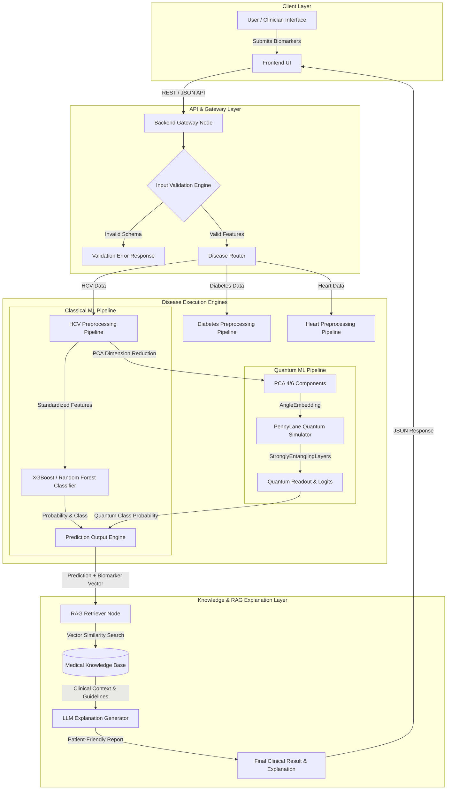

# SIH System Architecture Specification
## Multi-Disease Quantum & Classical ML Clinical Decision Support System

This document specifies the technical architecture of the Smart India Hackathon (SIH) Clinical Decision Support System. The platform combines classical machine learning (ML), PennyLane quantum machine learning (QML), and a Retrieval-Augmented Generation (RAG) explanation layer.

---

## 1. High-Level System Architecture & Flow

---

## 2. Pipeline Stage Breakdown

### Stage 1: User & Interface Layer
- Patients or clinical staff input biological metrics via modern web UI.
- All input fields enforce standard medical range validation (e.g., age, enzyme concentrations in U/L or mmol/L).

### Stage 2: Backend Gateway & Router
- Standardizes incoming requests and routes them to the appropriate disease-specific module (`HCV`, `DIABETES`, `HEART`).

### Stage 3: Disease-Specific Preprocessing
- Performs missing value imputation, categorical encoding, and Z-score standardization.
- Preprocessing objects (`Imputer`, `Encoder`, `Scaler`, `PCA`) are loaded from frozen production artifacts fitted strictly during offline training.

### Stage 4: Dual Execution Engine (Classical ML vs QML)
- **Classical ML Engine**: Passes full clinical feature vector through top tree ensembles (e.g., XGBoost) for high-accuracy probability scoring.
- **Quantum ML Engine**: Passes compressed PCA vectors through PennyLane variational quantum circuits (`AngleEmbedding` + `StronglyEntanglingLayers`) to provide quantum decision support.

---

## 3. RAG Explanation Layer Integration

> [!IMPORTANT]
> **CRITICAL ARCHITECTURAL BOUNDARY**: The RAG (Retrieval-Augmented Generation) layer is strictly an **explanation and patient education layer**. It **DOES NOT MODIFY, OVERRIDE, OR RETRAIN** the underlying ML or QML predictions.

### RAG Data Flow:
1. **Trigger**: ML/QML engine emits diagnostic category (e.g., `HCV-related pathology`) and confidence score (e.g., `98.74%`).
2. **Retrieval**: The system queries a vector database containing clinical guidelines (e.g., AASLD / EASL Hepatitis C management protocols) using key biomarker anomalies (e.g., elevated `AST` and `ALT`).
3. **Generation**: The RAG layer synthesizes a readable, patient-friendly summary explaining *why* the prediction was made and recommending next clinical steps (e.g., "Consult a hepatologist for confirmatory PCR testing").
